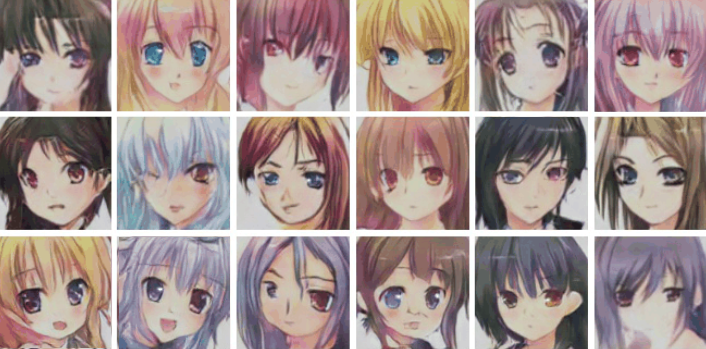
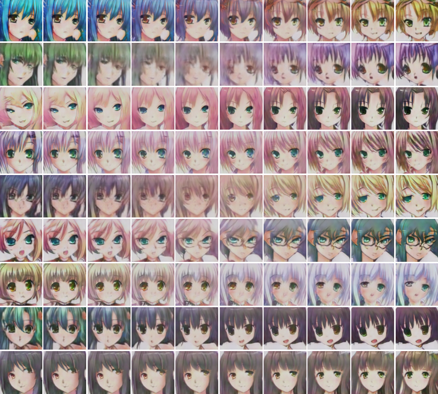

# __Fake anime using DCGAN - Pytorch__



## __Data preprocessing__

1. Augmentations:
    - Random Horizontal flip

2. Preprocessing:
    - Resize to 136x136
    - Center Crop for 128x128
    - Normalizing for range -1 to 1


## __Models__

Architecture: [DCGAN](https://arxiv.org/abs/1511.06434)

Discriminator's Summary:

```
----------------------------------------------------------------
        Layer (type)               Output Shape         Param #
================================================================
            Conv2d-1           [-1, 64, 64, 64]           3,136
         LeakyReLU-2           [-1, 64, 64, 64]               0
            Conv2d-3          [-1, 128, 32, 32]         131,072
       BatchNorm2d-4          [-1, 128, 32, 32]             256
         LeakyReLU-5          [-1, 128, 32, 32]               0
            Conv2d-6          [-1, 256, 16, 16]         524,288
       BatchNorm2d-7          [-1, 256, 16, 16]             512
         LeakyReLU-8          [-1, 256, 16, 16]               0
            Conv2d-9            [-1, 512, 8, 8]       2,097,152
      BatchNorm2d-10            [-1, 512, 8, 8]           1,024
        LeakyReLU-11            [-1, 512, 8, 8]               0
           Conv2d-12           [-1, 1024, 4, 4]       8,388,608
      BatchNorm2d-13           [-1, 1024, 4, 4]           2,048
        LeakyReLU-14           [-1, 1024, 4, 4]               0
           Conv2d-15              [-1, 1, 1, 1]          16,385
          Flatten-16                    [-1, 1]               0
================================================================
Total params: 11,164,481
Trainable params: 11,164,481
Non-trainable params: 0
----------------------------------------------------------------
Input size (MB): 0.19
Forward/backward pass size (MB): 9.63
Params size (MB): 42.59
Estimated Total Size (MB): 52.40
----------------------------------------------------------------
```

Generator's Summary:

```
----------------------------------------------------------------
        Layer (type)               Output Shape         Param #
================================================================
   ConvTranspose2d-1           [-1, 1024, 4, 4]       2,097,152
       BatchNorm2d-2           [-1, 1024, 4, 4]           2,048
              ReLU-3           [-1, 1024, 4, 4]               0
   ConvTranspose2d-4            [-1, 512, 8, 8]       8,388,608
       BatchNorm2d-5            [-1, 512, 8, 8]           1,024
              ReLU-6            [-1, 512, 8, 8]               0
   ConvTranspose2d-7          [-1, 256, 16, 16]       2,097,152
       BatchNorm2d-8          [-1, 256, 16, 16]             512
              ReLU-9          [-1, 256, 16, 16]               0
  ConvTranspose2d-10          [-1, 128, 32, 32]         524,288
      BatchNorm2d-11          [-1, 128, 32, 32]             256
             ReLU-12          [-1, 128, 32, 32]               0
  ConvTranspose2d-13           [-1, 64, 64, 64]         131,072
      BatchNorm2d-14           [-1, 64, 64, 64]             128
             ReLU-15           [-1, 64, 64, 64]               0
  ConvTranspose2d-16          [-1, 3, 128, 128]           3,075
             Tanh-17          [-1, 3, 128, 128]               0
================================================================
Total params: 13,245,315
Trainable params: 13,245,315
Non-trainable params: 0
----------------------------------------------------------------
Input size (MB): 0.00
Forward/backward pass size (MB): 12.38
Params size (MB): 50.53
Estimated Total Size (MB): 62.90
----------------------------------------------------------------
```

## __Training hyperparameters__

1. Objective loss : `Adversarial Loss`
2. Optimizer      : `Adam` for both models
3. Learning Rate  : 0.0004  for both models, and then decreased to 0.00002 by inspecting generator's outputs 
4. Trained Epochs : 33

## __Training progress__


## __Image interpolation__



## __Watch the video__

[](https://www.youtube.com/watch?v=cqXKTC4IP10)

# __Author - Rishik Mouyra__
